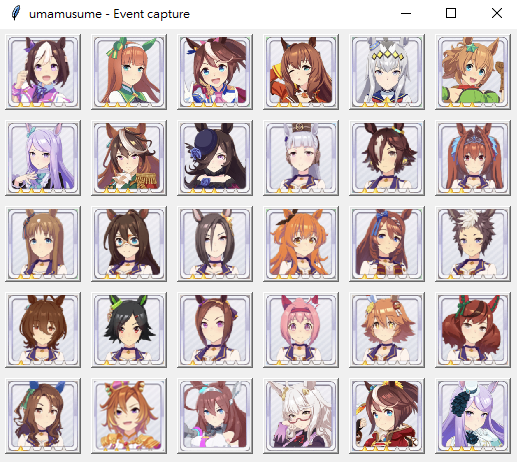

## Event Reader of Umamusume（ウマ娘）

The emulator I use [DMM Game Player](https://games.dmm.com/zh-CHT/) for screenshot capture. For others emulator, please set the offset in `main.py` line `117`,`128`.

Capture the events and detecting by [Tesseract-OCR]([Tesseract-OCR](https://github.com/UB-Mannheim/tesseract/wiki)). Please install it before execute the process.

Most of data parse from https://gamewith.jp/uma-musume/

Usage : `python main.py`

Select a umamusume to start. 

when program capture the event, it will get the show the options effect.
